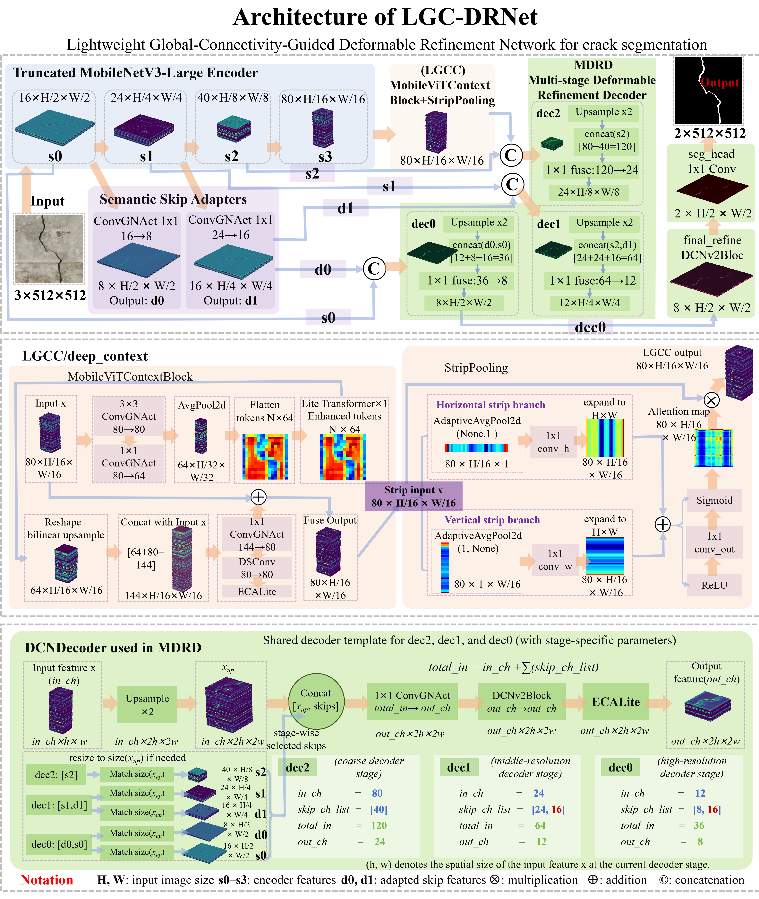
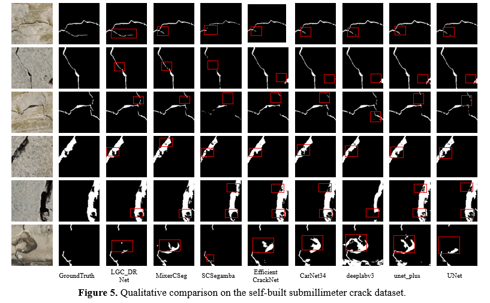
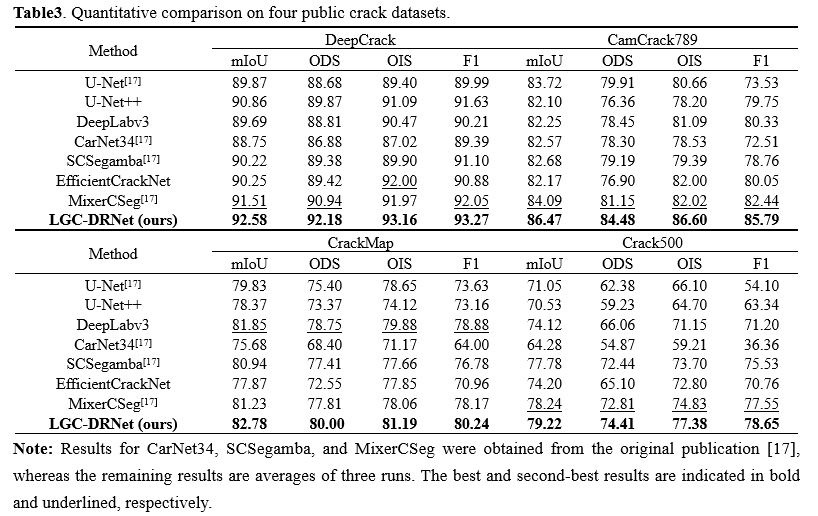
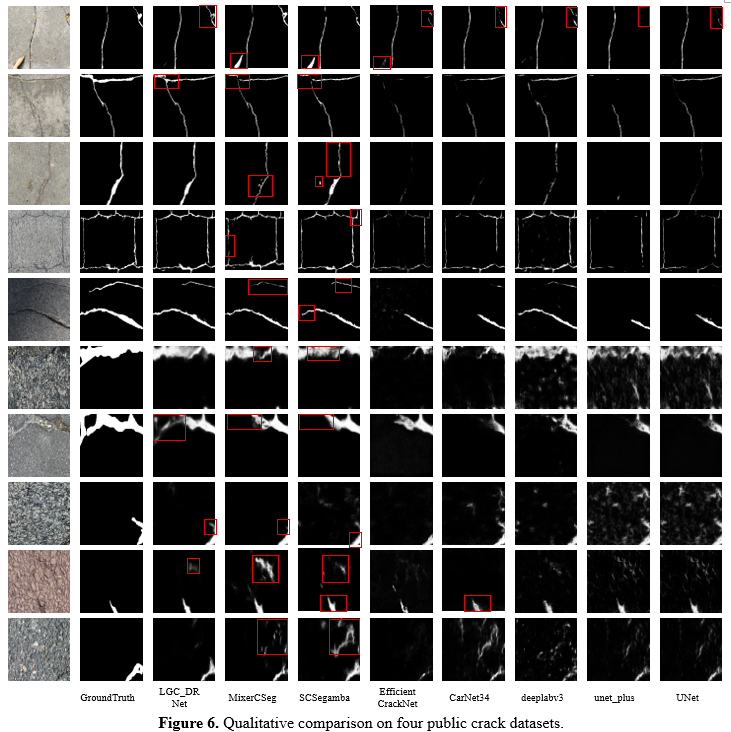

# LGC-DRNet

Official PyTorch implementation of **LGC-DRNet**, an ultralightweight network for fine-crack segmentation on resource-constrained edge platforms.

LGC-DRNet uses a truncated MobileNetV3-Large encoder, lightweight local–global context modeling with strip pooling, semantic skip adapters, and a narrow-channel deformable refinement decoder. This repository contains only the LGC-DRNet segmentation implementation. Camera hardware files and the RV1106 deployment package are not included in the current release.

Paper: *Edge-Deployable Ultralightweight LGC-DRNet for Fine-Crack Segmentation and Monitoring Using a Compact Vision Computing Camera*.

[Download datasets, checkpoints, predictions, and backbone weights](DATA_DOWNLOAD.md)

## Network architecture



*Architecture of LGC-DRNet, including the lightweight global connectivity context module and multi-stage deformable refinement decoder.*

## Main results

LGC-DRNet contains **0.352 M parameters** and requires **1.090 GFLOPs** for a 512 × 512 input.

### Self-built submillimeter crack dataset

LGC-DRNet achieves **81.65% IoU** and **90.53% mIoU** on the self-built dataset. Results in the comparison are reported as the mean of three independent runs, with standard deviations in parentheses.


*Table 1. Performance and complexity comparison on the self-built submillimeter crack dataset.*



*Fig. 5. Qualitative comparison on the self-built submillimeter crack dataset. Red boxes highlight local differences in crack continuity, fine-detail preservation, and background interference.*

### Four public crack datasets

LGC-DRNet achieves mIoU values of **92.58%**, **86.47%**, **82.78%**, and **79.22%** on DeepCrack, CamCrack789, CrackMap, and Crack500, respectively.



*Table 3. Quantitative comparison on four public crack datasets. Results for U-Net, CarNet34, SCSegamba, and MixerCSeg were taken from Ref. [17] in the manuscript. Results for LGC-DRNet, U-Net++, DeepLabv3, and EfficientCrackNet are means of three independent runs. Literature values are reference comparisons and were not reproduced in this repository.*



*Fig. 6. Qualitative comparison on four public crack datasets. Red boxes highlight local prediction differences for thin cracks and textured backgrounds.*

Comparison models appear only in the result figures. Their implementations are not included in this repository.

## Installation

Python 3.10–3.12 is recommended. Install a matching PyTorch and torchvision build for the target CPU or CUDA environment, followed by the remaining dependencies:

```bash
python -m pip install -r requirements.txt
```

CPU example:

```bash
python -m pip install torch==2.5.1 torchvision==0.20.1 --index-url https://download.pytorch.org/whl/cpu
python -m pip install -r requirements.txt
```

The network requires the compiled `torchvision.ops.DeformConv2d` operator. CUDA users must install mutually compatible PyTorch, torchvision, and CUDA builds.

## Data preparation

Download the resources listed in [DATA_DOWNLOAD.md](DATA_DOWNLOAD.md). Each dataset must follow this structure:

```text
dataset/
└── <dataset_name>/
    ├── train/
    │   ├── images/
    │   └── labels/
    └── test/
        ├── images/
        └── labels/
```

Masks must be PNG files with zero-valued background pixels and nonzero crack pixels. A `masks` directory may replace `labels`. For CamCrack789, use `--dataset CamCrack789` to enable its image-to-target filename mapping.

Validate a dataset before training:

```bash
python check_dataset.py \
  --train_dir ./dataset/CrackMap/train \
  --test_dir ./dataset/CrackMap/test \
  --dataset CrackMap
```

## Training

The paper experiments use MobileNetV3-Large backbone initialization. Download the backbone checkpoint and place it at `vit_checkpoint/mobilenet_v3_large-8738ca79.pth`.

Public-dataset example:

```bash
python train.py \
  --train_dir ./dataset/CrackMap/train \
  --test_dir ./dataset/CrackMap/test \
  --dataset CrackMap \
  --batch_size 1 \
  --pretrained 1 \
  --backbone_weights ./vit_checkpoint/mobilenet_v3_large-8738ca79.pth \
  --output_dir ./output/CrackMap_3run_pretrained
```

Self-built-dataset example:

```bash
python train.py \
  --train_dir ./dataset/fine_crack_530/train \
  --test_dir ./dataset/fine_crack_530/test \
  --dataset fine_crack_530 \
  --batch_size 2 \
  --pretrained 1 \
  --backbone_weights ./vit_checkpoint/mobilenet_v3_large-8738ca79.pth \
  --output_dir ./output/fine_crack_530_3run_pretrained
```

`train.py` performs three independent runs automatically and reports their mean. Default settings use 512 × 512 input, 50 epochs, AdamW, an initial learning rate of 0.0005, weight decay of 0.001, polynomial learning-rate decay, equal CE and Dice loss weights, frozen backbone batch-normalization statistics, and no random data augmentation.

## Independent evaluation

```bash
python test.py \
  --checkpoint ./path/to/best_mIoU.pth \
  --test_dir ./dataset/CrackMap/test \
  --dataset CrackMap \
  --output_dir ./test_results/run1
```

The loader accepts a plain state dictionary or a checkpoint wrapped in `state_dict`, `model_state_dict`, or `model`, including keys prefixed by `module.`. The output directory must not already exist.

## Image inference

```bash
python predict.py \
  --checkpoint ./path/to/best_mIoU.pth \
  --input ./images \
  --output_dir ./predictions/run1 \
  --mode sliding \
  --img_size 512 \
  --stride 384
```

The input can be one image or a directory. Sliding-window inference preserves the original resolution and averages probabilities in overlapping regions. No labels are required.

## Metric definitions

- Probability maps are quantized to 8-bit PNG before evaluation.
- Thresholds from 0.00 to 0.99 are evaluated in increments of 0.01.
- `mIoU` is the maximum image-mean two-class IoU over thresholds; `IoU` is foreground IoU at the same threshold.
- `Precision`, `Recall`, and `F1` use pooled pixel counts at the threshold maximizing pooled F1.
- `ODS` is the maximum image-mean F1 under one common threshold; `OIS` is the mean of each image's best F1.
- Per-image fixed-threshold metrics use `>= binary_threshold`; threshold-sweep metrics use `> threshold`.

## Verification and profiling

```bash
python -m unittest discover -s tests -v
python profile_model.py --img_size 512
```

Optional operator counting:

```bash
python -m pip install -r requirements-profile.txt
python profile_model.py --flops
```

The profiler reports unsupported operators. Do not describe a partial count as complete when deformable convolution or another operator is unsupported.

## Scope of this release

The repository currently provides the LGC-DRNet PyTorch code, download instructions, trained checkpoints, test predictions, and dataset resources. It does not currently provide the camera CAD/3D files, RKNN model, RV1106 deployment code, or complete device-development materials. After the relevant invention-patent applications receive official application numbers and acceptance notices, the authors plan to release additional camera-system model files and edge-deployment technical materials through this repository.

## Citation

If this work is useful in your research, cite the paper after its bibliographic record becomes available. GitHub can also generate software citation text from [CITATION.cff](CITATION.cff). The DOI and final journal information will be added after publication.

## Licenses and third-party materials

- Repository source code: [BSD 3-Clause License](LICENSE).
- Self-built dataset: see [DATA_LICENSE.md](DATA_LICENSE.md).
- Public datasets, pretrained weights, and third-party components: see [THIRD_PARTY_NOTICES.md](THIRD_PARTY_NOTICES.md).

The repository license does not grant rights to third-party datasets, pretrained weights, paper figures, camera hardware, patent claims, or materials not expressly included under that license.

## Contact

Corresponding author: Prof. Wenbin Deng, Xinjiang University, `dwb@xju.edu.cn`.
