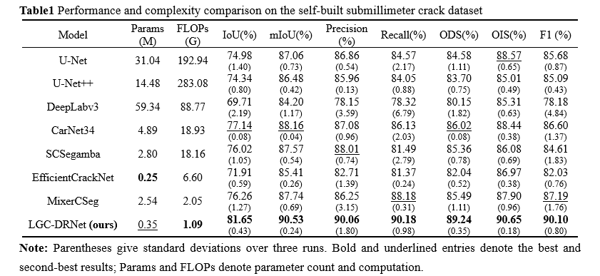

# LGC-DRNet

PyTorch implementation of LGC-DRNet for binary crack segmentation. Only the supplied LGC_DRNet architecture is included: a truncated MobileNetV3-Large encoder, global context, strip pooling, and a deformable refinement decoder. The layer names and tensor shapes used by the original state dictionary are preserved.

[Data and weights](DATA_DOWNLOAD.md)

## Network Architecture

LGC-DRNet combines a truncated MobileNetV3-Large encoder, lightweight local-global context modeling with strip pooling, and a narrow-channel deformable refinement decoder. Semantic skip adapters connect shallow features to the decoder to support fine-detail reconstruction.


*Architecture of LGC-DRNet, including the context module and multi-stage deformable refinement decoder.*

## Experimental Results

### fine_crack_530_dataset

LGC-DRNet achieves an IoU of 81.65% and an mIoU of 90.53% on the fine_crack_530_dataset. The following table compares segmentation performance and model complexity. Results are averaged over three random seeds, with standard deviations shown in parentheses. Bold and underlined entries indicate the best and second-best results, respectively.



*Performance and complexity comparison on the fine_crack_530_dataset. Params and FLOPs denote parameter count and computational cost, respectively.*


*Qualitative comparison on the fine_crack_530_dataset. Red boxes highlight local differences in the predicted crack structures. Examples illustrate crack continuity, fine-detail preservation, and responses to background interference.*

### Four Public Crack Datasets

Models are independently trained and tested on each dataset. LGC-DRNet achieves mIoU values of 92.58%, 86.47%, 82.78%, and 79.22% on DeepCrack, CamCrack789, CrackMap, and Crack500, respectively, ranking first among the methods in the comparison table.


*Quantitative comparison on four public crack datasets. Results for CarNet34, SCSegamba, and MixerCSeg are taken from the publication cited as [17] in the manuscript; the remaining results are averages over three random seeds. These literature results are reference comparisons rather than results reproduced in this repository. Reference numbers in the table follow the manuscript.*


*Qualitative comparison on four public crack datasets. Red boxes highlight local prediction differences across thin cracks and textured backgrounds.*

The tables and qualitative figures retain their manuscript numbering. Comparison models are shown for evaluation only; this repository includes only the LGC-DRNet implementation.

## Installation

Use Python 3.10–3.12. Install matching PyTorch and torchvision builds for your CPU or CUDA environment, then install the remaining dependencies:

```bash
python -m pip install -r requirements.txt
```

For a CPU installation:

```bash
python -m pip install torch==2.5.1 torchvision==0.20.1 --index-url https://download.pytorch.org/whl/cpu
python -m pip install -r requirements.txt
```

The network requires the compiled `torchvision.ops.DeformConv2d` operator. It is not replaced by ordinary convolution. CUDA execution requires matching CUDA-capable PyTorch/torchvision wheels. This package contains PyTorch training and inference; it does not contain an RKNN model or RV1106 deployment implementation.

Run all commands from this project directory.

## Data

Datasets, trained checkpoints, test predictions, and the MobileNetV3-Large backbone weights are distributed separately through cloud storage. See [DATA_DOWNLOAD.md](DATA_DOWNLOAD.md) for download links and placement instructions.

```text
dataset/CrackMap/train/images/sample.jpg
dataset/CrackMap/train/labels/sample.png
dataset/CrackMap/test/images/another_sample.jpg
dataset/CrackMap/test/labels/another_sample.png
```

Masks are PNG with zero background and nonzero crack pixels. `masks` may replace `labels`. Use `--dataset CamCrack789` for image-to-target mask names. Duplicate image stems within a split and missing/mismatched masks are rejected.

```bash
python check_dataset.py --train_dir ./dataset/CrackMap/train --test_dir ./dataset/CrackMap/test --dataset CrackMap
```

This command also reports byte-identical images across splits. It does not detect overlapping patches or differently encoded copies.

## Training

```bash
python train.py --train_dir ./dataset/CrackMap/train --test_dir ./dataset/CrackMap/test --dataset CrackMap --output_dir ./output/CrackMap_3seed
```

Training runs three fixed random seeds sequentially, and the reported results are averages over the three runs. There is no seed selection argument. Defaults retain 512×512 input, batch size 1, 50 epochs, AdamW with learning rate 0.0005 and weight decay 0.001, polynomial decay, CE/Dice weights 0.5/0.5, frozen backbone BN statistics and no random augmentation. The original `drop_last=True` behavior is retained; use `--drop_last 0` to include incomplete batches. This changes batch composition. Training resize uses the original PIL RGB resize, whereas evaluation uses antialiased tensor resize, retaining the supplied preprocessing.

For the original local pretrained initialization:

```bash
python train.py --pretrained 1 --backbone_weights ./vit_checkpoint/mobilenet_v3_large-8738ca79.pth
```

The paper results use MobileNetV3-Large backbone initialization. Download the backbone weights from [DATA_DOWNLOAD.md](DATA_DOWNLOAD.md) and provide a valid path with `--pretrained 1`. Missing or incompatible weights cause an explicit error. Use `--pretrained 0` only when random initialization is intended.

Each run saves `config.json`, `best_metrics.json`, all epoch state dictionaries, `weights/best_mIoU.pth`, a text epoch log, TensorBoard events, and best-epoch probability/label/binary images with per-image CSV metrics. The top output directory contains `three_seed_best_results.csv`, `three_seed_statistics.csv` and `three_seed_summary.txt` with mean, sample standard deviation (`ddof=1`), median, minimum and maximum. Existing configured run directories are protected from overwriting. There is no optimizer-state resume feature; use a new output directory for a new run.

## Independent evaluation

```bash
python test.py --checkpoint ./path/to/best_mIoU.pth --test_dir ./dataset/CrackMap/test --dataset CrackMap --output_dir ./test_results/run1
```

The checkpoint loader accepts a plain state dictionary or one wrapped in `state_dict`, `model_state_dict` or `model`, including a `module.` prefix. Architecture compatibility is checked strictly. Evaluation uses the same pipeline as training and exports `metrics.json`, configuration, probability maps, binary masks, labels and per-image metrics. The output directory must be new.

## Image inference

```bash
python predict.py --checkpoint ./path/to/best_mIoU.pth --input ./images --output_dir ./predictions/run1 --mode sliding --img_size 512 --stride 384
```

Input may be one image or a directory. Sliding windows preserve original resolution, average overlapping probabilities and align the final patch with the image boundary. Images smaller than a patch are padded and then cropped back. `--mode resize` instead outputs a square map at `--img_size`. Both modes save probability PNGs, binary masks and red overlays. No labels are required.

## Metric definitions retained from the supplied source

- Probability maps are rounded to 8-bit PNG and evaluated on that quantized representation, rather than min/max normalized per image.
- Thresholds are 0.00 through 0.99 in steps of 0.01, using `probability > threshold` for the sweep.
- `mIoU` is the maximum over thresholds of the image-mean, two-class IoU; `IoU` is foreground IoU at that same threshold.
- `Precision`, `Recall`, and `F1` use pooled pixel counts at the threshold maximizing pooled F1.
- `ODS` is the maximum image-mean F1 over a common threshold. This source-specific macro-average definition differs from pooled dataset F1, which is reported as `F1`.
- `OIS` is the mean of each image's best F1.
- Per-image fixed-threshold CSV metrics use the quantized probability and `>= binary_threshold`; binary visualizations use unquantized probabilities. Quantization can therefore cause small boundary differences.
- Empty foreground union has IoU 0; precision is 1 when no pixel is predicted positive; recall is 0 when no positive ground truth exists. These source conventions are retained.
- The existing procedure evaluates `test_dir` after every epoch and chooses the checkpoint with the highest swept `mIoU` on that split. The implementation retains this selection behavior. Dataset names do not change this behavior; document the split's role accurately when reporting results.

## Checks and model profile

```bash
python -m unittest discover -s tests -v
python profile_model.py --img_size 512
```

Optional operator counting:

```bash
python -m pip install -r requirements-profile.txt
python profile_model.py --flops
```

The profiler reports unsupported operators. A partial fvcore count must not be described as a complete FLOP count, particularly if deformable convolution is unsupported. No paper complexity or accuracy claims are hardcoded.

## Publication metadata

The datasets and weights are available through [DATA_DOWNLOAD.md](DATA_DOWNLOAD.md). Add the final paper citation and DOI after publication. Before making the repository public, add a project license and any third-party notices required by the redistributed public datasets.
